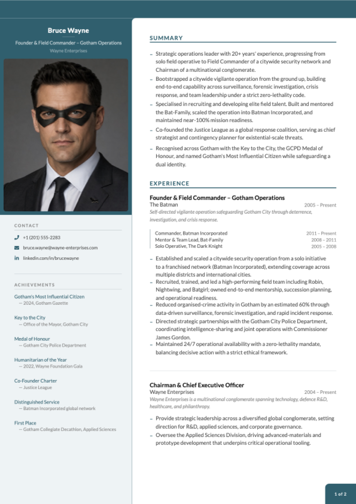

<p align="center">
  
</p>

<p align="center"><b>Structured input. Professional output. To the power of X.</b></p>

<p align="center">
  <a href="https://github.com/hrtips/cvx/actions/workflows/ci.yml"></a>
  <a href="https://www.npmjs.com/package/@hrtips/cvx"></a>
  <a href="https://www.npmjs.com/package/@hrtips/cvx"></a>
  <a href="https://packagephobia.com/result?p=%40hrtips%2Fcvx"></a>
  <a href="LICENSE"></a>
</p>

**CVX turns plain YAML into a professionally designed CV PDF — one command, fully local, no accounts; your data never leaves your machine.** Use it two ways: edit the YAML yourself, or have any AI assistant write it for you from your existing CV — CVX validates the files and tells the assistant exactly what to fix.

> **🤖 AI assistants:** if a user asked you to create their CV with CVX, follow the default flow in the [AI guide](https://raw.githubusercontent.com/hrtips/cvx/main/docs/ai-guide.md) (section "Default flow (for assistants)"). Non-negotiables even if you skip the link: **never invent facts** — every entry must be truthful to the user's input; **linkedin.com URLs are unfetchable even when public** — don't infer, ask for the profile's **More → Save to PDF** export or pasted text instead; ask for a **square photo** in your first reply (it can't be generated; the CV renders fine without one); and CVX is the only renderer — never substitute another PDF generator.

**No terminal? No problem.** Paste this into any AI chat (Claude, ChatGPT, Gemini, …):

```text
Create my CV with https://github.com/hrtips/cvx — open that page and follow its instructions for AI assistants.
Here is my LinkedIn profile: <your profile URL> (or attach your current CV and a photo instead).
```
<p align="center">
  
</p>
<p align="center"><sub>Page 1 of the scaffolded example CV — plus an <a href="assets/hero-ats.png">ATS-safe single-column variant</a> via <code>--ats</code>. Pagination has improved since these were captured; your build may split pages differently.</sub></p>

---

## Create your CV in two minutes

```bash
npx @hrtips/cvx init     # scaffold cv-content/ with a complete example CV
npx @hrtips/cvx build    # render it to a PDF
```

`init` gives you a finished, working CV — **Bruce Wayne's**, and yes, really. Open `bruce-wayne.pdf` and you're looking at a designed two-page CV: photo, sidebar, achievements, the lot.

Now make it yours. Open the `cv-content/` folder, and replace Bruce's details with your own, one file at a time:

```
cv-content/
  personal.yaml       ← start here: your name, title, contact details
  summary.yaml        ← the bullet points at the top of page 1
  experience.yaml     ← your work history (the bulk of the CV)
  education.yaml      ← degrees, institutions, years
  competencies.yaml   ← skill pills in the sidebar
  achievements.yaml   ← awards and recognitions
  referees.yaml       ← referees, or [] for "available upon request"
  images/profile.jpg  ← your photo (square, 400×400px or larger)
```

Re-run `npx @hrtips/cvx build` after each file and watch the PDF update — seeing Bruce's entry next to yours makes the format self-explanatory. The output file is named after you automatically (`jane-doe.pdf`).

Made a typo or unsure a file is right? `npx @hrtips/cvx validate` checks everything at once and tells you exactly what to fix:

```
cv-content/personal.yaml
  ⚠ unknown key "linkdin"
      ↳ did you mean "linkedin"?
```

Every scaffolded file also carries a `$schema` header, so editors with YAML support (VS Code + the YAML extension, JetBrains, …) autocomplete keys and flag mistakes as you type.

Applying through a job portal? Generate the ATS-safe variant too — single column, no colours, machine-friendly:

```bash
npx @hrtips/cvx build --ats
```

### CLI reference

| Command | Does |
|---|---|
| `npx @hrtips/cvx init` | Scaffold `cv-content/` with the example CV (won't overwrite an existing one) |
| `npx @hrtips/cvx validate` | Check `cv-content/` — every problem at once, with file + field paths and fixes |
| `npx @hrtips/cvx validate --strict` | Also fail on warnings (unknown keys); recommended for agents/CI |
| `npx @hrtips/cvx build` | Render `cv-content/` to `<your-name>.pdf` |
| `npx @hrtips/cvx build --ats` | Render the ATS-safe single-column variant |
| `npx @hrtips/cvx list` | Show available themes and layouts |
| `npx @hrtips/cvx --help` / `--version` | Help / version |

All commands accept `--json` for machine-readable output (one JSON object on stdout, logs on stderr) and use semantic exit codes: `0` ok, `2` validation failed, `3` render failed, `64` usage error. `init` is a convenience, not a prerequisite — `build` renders any `cv-content/` folder with valid YAML (built-in themes and layouts need no extra files).

**Content schema:** content files are versioned by `schemaVersion` in `config.yaml` (currently `1`) and validated against the [canonical JSON Schema](schema/v1/cvx.schema.json). New keys may appear within a schema major. Keys can also be **removed** when they are measured to do nothing — `page1ExperienceCount` and `page1SplitBullets` were, in 1.8.0 — in which case builds keep working and `validate` names the removal, while `validate --strict` treats the now-unknown key as an error. The CHANGELOG says so at the release that does it.

---

## What goes in each file

These are excerpts from the scaffolded example — build it once and you can see exactly where each snippet lands on the page.

**personal.yaml** — the header and contact block:
```yaml
name: Bruce Wayne
title: Founder & Field Commander – Gotham Operations
company: Wayne Enterprises
phone: "+1 (201) 555-2283"
phoneHref: "tel:+12015552283"
email: bruce.wayne@wayne-enterprises.com
linkedin: linkedin.com/in/brucewayne
linkedinHref: "https://www.linkedin.com/in/brucewayne"
```

**experience.yaml** — one entry per role; `progression` (optional) renders a title history inside the entry:
```yaml
- role: Founder & Field Commander – Gotham Operations
  company: The Batman
  period: 2005 – Present
  description: Self-directed vigilante operation safeguarding Gotham City through deterrence, investigation, and crisis response.
  progression:
    - title: Commander, Batman Incorporated
      period: 2011 – Present
    - title: Solo Operative, The Dark Knight
      period: 2005 – 2008
  bullets:
    - Established and scaled a citywide security operation from a solo initiative to a franchised network (Batman Incorporated).
    - Recruited, trained, and led a high-performing field team including Robin, Nightwing, and Batgirl.
    - Reduced organised-crime activity in Gotham by an estimated 60% through data-driven surveillance and rapid incident response.
```

**summary.yaml** — the bullet list at the top of page 1:
```yaml
- "Strategic operations leader with 20+ years' experience, progressing from solo field operative to Field Commander of a citywide security network."
- "Co-founded the Justice League as a global response coalition, serving as chief strategist and contingency planner for existential-scale threats."
```

**education.yaml**
```yaml
- degree: "Applied Sciences & Criminology (self-directed)"
  institution: League of Shadows
  period: 1998 – 2004

- degree: BSc, Criminology & Chemistry
  institution: Gotham University
  period: 1994 – 1998
```

**competencies.yaml** — rendered as skill pills in the sidebar:
```yaml
- Strategic Planning
- Criminal Investigation
- Crisis Response
- Surveillance & Intelligence
```

**achievements.yaml**
```yaml
- year: Gotham's Most Influential Citizen
  text: "— 2024, Gotham Gazette"

- year: Key to the City
  text: "— Office of the Mayor, Gotham City"
```

**referees.yaml** (use `[]` to print "available upon request"):
```yaml
- name: Diana Prince
  title: Founding Member, Justice League
  company: Themysciran Embassy
  email: d.prince@justiceleague.org
  phone: "+1 (202) 555-0177"
```

Delete what you don't need — an empty file (or `[]`) simply drops that section from the CV. Any new `.yaml` file you drop into `cv-content/` is auto-discovered as a content key.

The complete field-by-field schema for every file lives in [docs/cv-schema.md](docs/cv-schema.md).

### Let an AI write the YAML for you

The formats are deliberately LLM-friendly, and the schema is published for machines ([llms.txt](llms.txt), [docs/cv-schema.md](docs/cv-schema.md)). **[The AI guide](docs/ai-guide.md)** has copy-paste prompts for every route; the short version:

**Coding agent** (Claude Code, Cursor, …) — lowest friction: run `npx @hrtips/cvx init`, then ask the agent to replace the example content with your details and build. The scaffolded `cv-content/README.md` documents the schema, so the agent edits, runs `npx @hrtips/cvx build`, and fixes errors itself.

**Chat assistant** (Claude, ChatGPT, …) — paste your existing CV or LinkedIn profile text along with this prompt:

> Read the CVX content schema at https://raw.githubusercontent.com/hrtips/cvx/main/docs/cv-schema.md then convert my CV below into CVX cv-content/ YAML files. Output each file in its own fenced code block titled with the filename. Keep every fact truthful to my input — don't invent anything.

Save the generated files into `cv-content/`, drop in your photo, run `npx @hrtips/cvx build`. No web access in your assistant? Use the [self-contained prompt](docs/ai-guide.md#route-c--chat-assistant-self-contained-prompt).

### Plug it into your agent (MCP)

CVX ships an MCP server — any MCP client (Claude Desktop, Claude Code, Cursor, VS Code, …) can drive the whole loop with five tools: `get_schema`, `init_cv`, `validate_cv`, `build_pdf`, and `plan_layout` (a dry run that reports how the CV paginates — page count, per-page column fills, what landed where — without writing a PDF). No API keys, fully offline.

CVX renders 100% of your YAML and never drops, clips, or hides text to fit a page — so an assistant driving it can't quietly cut a section to hit a page count either. If the CV runs longer than you want, it surfaces the trade-off and you decide what goes.

```bash
npx @hrtips/cvx mcp init --client claude          # Claude Code (.mcp.json, project)
npx @hrtips/cvx mcp init --client claude-desktop  # Claude Desktop (global config)
npx @hrtips/cvx mcp init --client cursor          # Cursor (.cursor/mcp.json)
npx @hrtips/cvx mcp init --client vscode          # VS Code (.vscode/mcp.json)
```

Then restart the client and ask it to make your CV — it fetches the schema, scaffolds, fills in your details, validates after every edit, and renders the PDF. The config writer merges into existing files; it never clobbers other servers. There's also a ready-made [Agent Skill](skills/cvx/SKILL.md) with the same loop for skill-capable agents.

### Build it into a ChatGPT GPT

ChatGPT's sandbox has a Node runtime but no network, so `npx` cannot work there. CVX therefore ships as **one self-contained file** — schema, template, fonts and all — attached to [every release](https://github.com/hrtips/cvx/releases/latest) as `cvx.bundle.min.js`. It needs nothing but Node 20+: no install, no `node_modules`, no network.

Upload it to any ChatGPT conversation and ask it to run — or spend three minutes wiring a personal GPT that fetches the current release itself, so it never goes stale. **[docs/custom-gpt.md](docs/custom-gpt.md)** has both, including the instructions to paste and the action to import. (OpenAI withdrew public GPT sharing, so this is a build-your-own recipe rather than a link someone can hand you.)

The GPT does what a chat assistant otherwise cannot: it renders the PDF, **opens it and looks at the pages**, then fixes the layout before you ever see it.

### Your photo

Drop it into `cv-content/images/` as `profile.<ext>` — `jpg`, `jpeg`, `png`, or `webp` are auto-detected (that order wins if several exist). Square crop, at least 400×400px.

---

## Themes, layouts, and page flow

Everything visual is controlled by `cv-content/config.yaml`:

```yaml
theme: teal               # teal | coral | mono
layout: two-column        # two-column | single-column
```

Change a value, re-run `npx @hrtips/cvx build`, done.

**Themes** control colour and styling:

| Theme | Accent | Description |
|---|---|---|
| `teal` | `#1a6070` | Professional teal (default) |
| `coral` | `#c0534a` | Warm coral red |
| `mono` | `#000000` | Black and white, ATS-optimised |

**Layouts** control page structure:

| Layout | Structure | Description |
|---|---|---|
| `two-column` | Sidebar + main column | Designed CV with photo, identity block, achievements |
| `single-column` | Full width | ATS-safe, no sidebar, no decorative elements |

**Pagination** — experience entries are distributed across pages automatically (greedy bin-packing), never overflowing a page, and an entry too tall for the remaining room is split at a bullet boundary and continued overleaf. There are no pagination settings: the layout follows the content. (The old `page1ExperienceCount` / `page1SplitBullets` keys were removed — measured, they never reduced the page count, and forcing them pushed content onto an unnumbered extra sheet. A config that still has them gets a validation message saying exactly that.)

### Script support

**CV rendering is English/Western-European Latin only.** CVX bundles [Lato](https://fonts.google.com/specimen/Lato) and registers no fallback font, so scripts Lato doesn't cover — Cyrillic, Greek, Vietnamese, Turkish `ş`/`ğ`, Czech/Romanian diacritics, and all non-Latin scripts (Devanagari, Tamil, Sinhala, CJK, Arabic, …) — render invisibly. `cvx validate` and `cvx build` warn loudly when your content contains characters the bundled font cannot draw, so this fails visibly rather than silently.

This is a deliberate scope decision, not an oversight: shipping fallback fonts for those scripts would blow the package-size budget many times over. (The project website is multilingual; the renderer is not — the two are independent.)

### Custom layouts

You can define your own page structure — drop a `.yaml` file into `cv-content/layouts/` and reference it by filename:

```yaml
# cv-content/layouts/compact.yaml
template: two-column

pages:
  first:
    sidebar:
      - identity-photo
      - contact
    main:
      - summary
      - spacer: 27
      - experience

  continuation:
    sidebar:
      - identity-compact
      - education
      - competencies
      - achievements
    main:
      - experience:continued

  last:
    sidebar:
      - identity-compact
      - referees
    main:
      - experience:continued
```

Then set `layout: compact` in `config.yaml`.

**The sidebar's three lists are one ordered flow, not three page assignments.**
`first.sidebar` + `continuation.sidebar` + `last.sidebar` are concatenated in
that order, and CVX measures the result to decide which page each section lands
on. `last.sidebar: [referees]` therefore means *"referees comes last in the
sidebar"*, not *"referees renders on the last page"*. Use the buckets to express
**order**; let pagination be measured. (`identity-photo`/`identity-compact` are
the exception — they are injected at the top of every page's sidebar rather than
packed.) The **main** lists remain per-page-kind: `first.main` on page 1,
`last.main` on the final page, `continuation.main` in between.

Available section keys:

| Key | Renders |
|---|---|
| `identity-photo` | Name, title, company + profile photo (sidebar) |
| `identity-compact` | Name, title, company without photo (sidebar) |
| `contact` | Phone, email, LinkedIn, location with icons (sidebar) |
| `achievements` | Year + description list (sidebar) |
| `education` | Degree, institution, period (sidebar) |
| `competencies` | Skill tags as pills (sidebar) |
| `referees` | Referee contact details (sidebar) |
| `summary` | Bullet point list (main column) |
| `experience` | Experience entries for page 1 (main column) |
| `experience:continued` | Continuation experience entries (main column) |
| `header-ats` | Full-width name/title/contact header (single-column) |
| `spacer: N` | Vertical spacer of N points |

---

## ATS & AI-parser keywords

Both PDFs embed a keyword list into the standard **`Keywords` metadata field** — the field some applicant tracking systems (ATS) and AI CV parsers read. Keywords live in metadata, **not** as hidden text on the page.

> **Reality check:** most mainstream ATS rank on text extracted from the CV *body*, and support for the PDF `Keywords`/XMP field is inconsistent. Treat this as a best-effort supplement to a keyword-rich body — not a substitute, and not a reliable ranking lever on its own. Keep every keyword **truthful**; stuffing false or irrelevant terms causes a metadata/body mismatch that gets a CV auto-rejected.

Keywords come from two sources, merged and de-duplicated (body-derived terms first):

1. **Auto-derived** from your `competencies.yaml` and job titles (company names are deliberately excluded as low-signal).
2. **Curated** in `cv-content/keywords.yaml` — a flat list, or grouped under headings:

```yaml
# cv-content/keywords.yaml
- Operations Management
- Risk Management
# …or grouped:
Leadership: [Executive Leadership, Team Building]
```

Configure in `config.yaml`:

```yaml
atsKeywords:
  enabled: true       # master switch                                  (default: true)
  autoDerive: true    # also derive from competencies + job titles      (default: true)
  max: 40             # optional cap; body-derived terms are kept first (default: all)
```

---
---

# For developers

Everything below is about hacking on CVX itself — custom themes, the rendering pipeline, and contributing. You don't need any of it to create a CV.

## Working from a clone

```bash
git clone git@github.com:hrtips/cvx.git
cd cvx
npm install
npm run dev        # live browser preview at http://localhost:5173
npm run pdf        # generate PDF (same pipeline as `cvx build`)
npm run pdf:ats    # generate the ATS variant
npm test           # unit tests
npm run build:lib  # build the publishable lib/ (what the CLI runs)
```

The repo's `cv-content/` carries the same Bruce Wayne example, so a clone builds out of the box. A photo crop helper is included: `python3 scripts/crop-profile.py path/to/photo.jpg`.

## Custom themes

> Themes ship inside the package, so custom themes currently require working from a clone — the `npx` CLI offers the three built-ins.

Drop a `.js` file in `src/pdf/themes/` — it's auto-discovered, no registration needed:

```js
// src/pdf/themes/navy.js
import { tealTheme } from './teal.js'

export const navyTheme = {
  ...tealTheme,
  name: 'navy',
  palette: {
    ...tealTheme.palette,
    accent:    '#1e3a5f',
    sidebarBg: '#eef1f5',
    tagBg:     '#d0d8e8',
    tagText:   '#1e3a5f',
    divider:   '#b8c4d4',
  },
}
```

Set `theme: navy` in `config.yaml`. The theme object has five namespaces you can override:

| Namespace | Controls |
|---|---|
| `palette` | All colours — accent, backgrounds, text, tags, dividers, semantic opacity colours |
| `typography` | Font sizes, weights, letter spacing, line heights per element |
| `spacing` | Gaps, margins, padding values used by all components |
| `chrome` | Decorative dimensions — border radii, divider widths, photo size, corner badge |
| `geometry` | Page dimensions, column fractions, padding objects |

## Auto-discovery

Convention over registration — drop a file in the right folder and it's picked up:

| What | Where to drop it | How it's found |
|---|---|---|
| **Content** | `cv-content/*.yaml` | Any `.yaml` file (except `config.yaml`) becomes a content key matching its filename |
| **Themes** | `src/pdf/themes/*.js` | Any `.js` file exporting an object with a `name` property |
| **Layouts** | `cv-content/layouts/*.yaml` | Any `.yaml` file with a `template` and `pages` structure |
| **Profile photo** | `cv-content/images/profile.*` | First match of `.jpg`, `.jpeg`, `.png`, `.webp` |

To add a whole new content section (e.g. publications): create `cv-content/publications.yaml` (auto-available as `content.publications`), build a section component in `src/pdf/sections/`, register it in `registry.js`, then reference it from a layout.

## Architecture

Three concerns, independently swappable:

```
Content (YAML)  ×  Theme (JS)  ×  Layout (YAML)
     ↓                ↓               ↓
  what to say    how it looks    where it goes
```

The rendering pipeline:

```
config.yaml → resolves theme + layout
    ↓
cv-content/*.yaml → auto-loaded into data bag
    ↓
layout.js → packs experience entries across pages (using theme metrics)
    ↓
CVDocument → picks template (TwoColumn or SingleColumn)
    ↓
template → renders slots from layout config via section registry
    ↓
sections → read theme from React context, render content
    ↓
@react-pdf/renderer → PDF buffer → file
```

## Project structure

```
cv-content/                      ← content (the repo carries the example CV)
  *.yaml                         ← auto-discovered content files
  config.yaml                    ← theme, layout, pagination
  layouts/                       ← auto-discovered layout definitions
  images/profile.<ext>           ← photo (jpg/jpeg/png/webp)

src/pdf/                         ← framework
  CVDocument.jsx                 ← unified config-driven document
  ATSDocument.jsx                ← standalone ATS document
  ThemeContext.jsx               ← React context + useStyles hook
  render.js                      ← shared render pipeline (CLI + scripts)
  layout.js                      ← theme-aware page-packing + sidebar resolution
  keywords.js                    ← ATS/AI-parser keyword metadata
  reproducible.js                ← SOURCE_DATE_EPOCH support (see below)
  profilePhoto.js                ← shared profile-image extension precedence
  loadContent.js                 ← auto-discovers cv-content/*.yaml
  loadLayout.js                  ← normalizes layout YAML → slot config
  fonts.js                       ← Lato font registration
  *.test.js                      ← Vitest unit tests (co-located)
  themes/                        ← auto-discovered themes (teal, coral, mono)
  templates/                     ← page shells (TwoColumn, SingleColumn)
  sections/                      ← content sections + registry
  components/                    ← shared leaf components

scripts/
  export-pdf.js                  ← npm run pdf
  export-pdf-ats.js              ← npm run pdf:ats
  build-lib.js                   ← npm run build:lib (publishing build)
  crop-profile.py                ← photo crop helper

bin/cvx.js                    ← npx CLI (init / build)
template/cv-content/             ← starter content scaffolded by `cvx init`
lib/                             ← generated: published transform of src/pdf (gitignored)
```

## Testing

```bash
npm test
```

Unit tests cover the pure logic modules — keyword building, page packing, sidebar resolution, reproducibility helpers, and the profile-photo picker. Tests live next to the code they cover (`src/pdf/*.test.js`) plus `test/` for cross-cutting checks. CI runs the suite on Linux and macOS across Node 20/22/24 (plus Windows on Node 22), then packs the tarball and exercises the installed CLI end-to-end, including a byte-identical reproducibility gate.

## Quality gates

The build is deliberately hostile — a change lands only if it clears every gate below with **zero warnings**. Run them all locally with `npm run check` (lint + types + coverage + dead-code); CI enforces them in the `quality` and `security` jobs.

| Gate | Command | Enforces |
|---|---|---|
| Lint + format | `npm run lint` | [Oxlint](https://oxc.rs) (fast correctness/`suspicious`, incl. `rules-of-hooks`, `no-focused-tests`) **+** [Biome](https://biomejs.dev) (format, imports, deeper lint) — zero warnings |
| Types | `npm run typecheck` | `tsc --noEmit` with `checkJs` + full `strict` over the JS/JSX sources (types via JSDoc + `src/pdf/types.d.ts`, derived from the JSON schema) |
| Coverage | `npm run test:cov` | [Vitest](https://vitest.dev) v8, **per-file ≥ 90%** lines/functions/statements, ≥ 85% branches — no global averaging, no per-file waivers |
| Dead code | `npm run knip` | no unused files, exports, or dependencies |
| Package | `npm run publint` · `npm run attw` | [publint](https://publint.dev) packaging + [arethetypeswrong](https://arethetypeswrong.github.io) resolution |
| Supply chain | `security` CI job | [actionlint](https://github.com/rhysd/actionlint) · [zizmor](https://docs.zizmor.sh) (SHA-pinned actions, least-privilege) · [gitleaks](https://gitleaks.io) · [osv-scanner](https://google.github.io/osv-scanner/) |

Formatting/lint autofix: `npm run lint:fix`. GitHub Actions are pinned to commit SHAs and kept current by Dependabot.

## Reproducible builds

Set [`SOURCE_DATE_EPOCH`](https://reproducible-builds.org/docs/source-date-epoch/) (seconds since the Unix epoch) to make PDF output byte-identical run after run — useful for CI checks and for verifying that a content change is the *only* thing that changed:

```bash
SOURCE_DATE_EPOCH=$(git log -1 --format=%ct) npx @hrtips/cvx build   # or npm run pdf
```

This pins the PDF's `CreationDate` (and with it the trailer file ID), the font-subset names, and the object write order — the things that otherwise vary per run. Unset, builds behave normally and stamp the current time.

Byte-identical output is guaranteed for the same platform and Node version. Builds from different OSes or Node majors are visually identical but not byte-identical (font subsets embed in a platform-dependent order, and zlib output varies across Node versions).

## Tech stack

- **[@react-pdf/renderer](https://react-pdf.org/)** — renders React to PDF (no headless browser)
- **[Vite](https://vitejs.dev/) + React** — live browser preview
- **[js-yaml](https://github.com/nodeca/js-yaml)** — YAML parsing (pinned to 4.x to match `@rollup/plugin-yaml`)
- **[esbuild](https://esbuild.github.io/)** — transform-only build of `lib/` for publishing
- **[tsx](https://github.com/privatenumber/tsx)** — runs the repo export scripts
- **[Vitest](https://vitest.dev/)** — unit tests
- **[Lato](https://fonts.google.com/specimen/Lato)** — embedded font (Light 300, Regular 400, Bold 700)

---

## License

[Apache-2.0](LICENSE) © ramith.

The bundled [Lato](https://fonts.google.com/specimen/Lato) fonts are licensed separately under the [SIL Open Font License 1.1](https://openfontlicense.org/open-font-license-official-text/).
